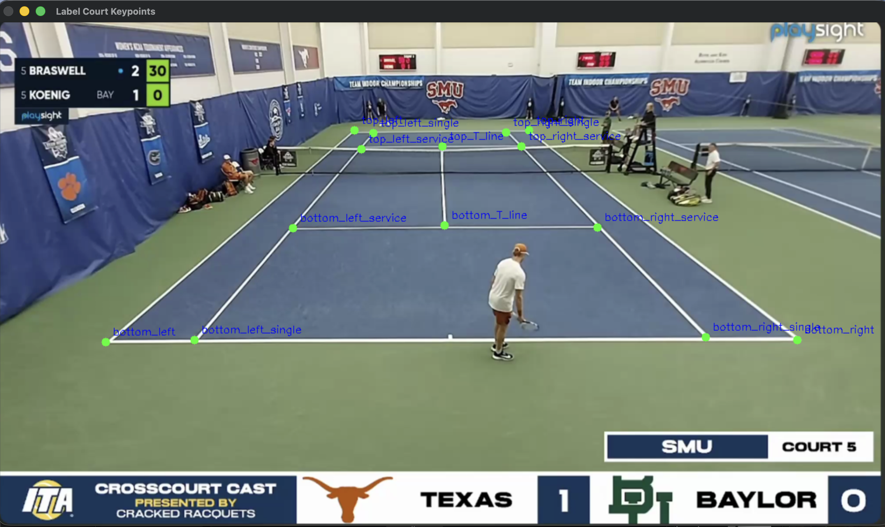

# Tennis Match Automatic Trimming and Shot Recognition

An integrated computer vision pipeline for tennis match analysis that automatically trims inactive segments from full match recordings and performs shot recognition on the remaining active game play footage. 

This project is built on top of the existing tennis auto trimming system from [https://github.com/bell1103/auto_trimming_tennis_match](URL) and a sequential MLP tennis shot recognition model referenced from [https://github.com/antoinekeller/tennis_shot_recognition](URL)


# Features
- Automatically detects active point-play segments from tennis match recordings 
- Removes downtime between points to create shortenend video
- Extracts human pose keypoints for each frame 
- Performs tennis shot recognition for each frame
- Overlays predicted shot labels, shot probabilty, shot count, and human pose keypoints onto the output video
- Intended to work on videos recorded from a single camera above and behind the court (not all components worked accurately)
- Interactive notebook workflow for everything to be ran in one environment

# Shot Classes
Our model was trained to recognize the following shot types:
- forehand 
- backhand
- serve 
- forehand_volley
- backhand_volley 
- neatral (when not hitting a shot)


# Setup and Preperation

## Input video preperation
To set of the input video, place the match recoding you want to proccess in the <input> folder.

Here is a Google Drive that contains some video you could run:   [Sample Input Videos](https://drive.google.com/drive/folders/1-rWl3ZSktNiCr3U1VYeldyYOIbcDvjI_?usp=sharing)

The videos included in this folder were collected from YouTube channels such as **Cracked Racquests** and **NewYCPhoto**. 

## Virtual enviornment setup

Create a virtual envornment and install the required dependencies:
```bash
    python -m venv tf-env
    source tf-env/bin/activate
    pip install -r requirements.txt
```

# Run pipeline.ipynb 
Complet the whole pipeline following the instructions in the notebook. 

When running the video trimming process, you will be promted to lable court keypoints, please label them in the order provided in the notebook. 




# Result

## Model Performance Discussion

As you can be observed, our shot recognition model’s performance on the trimmed video recordings is relatively poor. One key reason for this is a perspectiv shift between the training data and the inference data.

The model was trained on datasets captured from a slightly different camera angle (right behind the court). As a result, the model is highly sensitive to perspective changes.

To address this issue, the model would need to be trained on datasets captured from a **behind and above the court viewpoint**, which better matches the inference format used in this pipeline. This would likely improve robustness.

However, we did not realize the issue until later stage in the project and due to time constraints we weren't able to make the adjustment in time.

## Bounus
To infer our model on a video consitent with the training dataset perspective, you can infer the model on *sample.mp4* from [Sample Input Videos](https://drive.google.com/drive/folders/1-rWl3ZSktNiCr3U1VYeldyYOIbcDvjI_?usp=sharing):

```bash
   python infer_shot_recognition.py \
  --video_path input/sample.mp4 \
  --model_path weights.keras \
  --output_video output/sample_complete.mp4
```
The result of inference on this video has high accuracy which shows that our model's performs well on data consitent with its training dataset. 